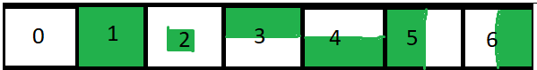

# Bästa spelet någonsin gjort förmodligen

[Editor docs](https://github.com/Erik-For/under-school-testing/blob/master/EDITOR.md)

## Setup and Building (you need node and npm)
### Run the following commands to setup
- ```npm i``` for installing necessary packages 
- ```npx tsc -w ``` this will run and compile .ts file automatically to .js files
### The page is in ```build/```


# Docs

### sprite.ts
```ts
// SpriteSheet is responsible for loading in an image and slicing it to Sprites
class SpriteSheet {};

// SpriteSheetLoader loades multiple SpriteSheets and runs a callback once they all have loaded,
// the SpriteSheetLoader also stores a map with all the loaded SpriteSheets
class SpriteSheetLoader {}; 

/*
 the Sprite class stores information about what SpriteSheet it is from.
 The Sprite itself dosent have any image data in
 That is in the SpriteSheet
*/
class Sprite {};

// the render function renders a sprite at a given location, this method should generaly be used with care
// This is because Tiles (read more about the tile class in scene.ts) can have multiple sprites with z-indexes
function render(ctx: CanvasRenderingContext2D, spriteSheetLoader: SpriteSheetLoader, sprite: Sprite, x: number, y: number, width: number, height: number) {}

// same as render execpt it renders multiple sprites based on z-index
function renderMany(ctx: CanvasRenderingContext2D, spriteSheetLoader: SpriteSheetLoader, sprites: Array<Sprite>, x: number, y: number, width: number, height: number) {
```

### scene.ts
```ts
// The scene class has a map: Map<String, Map<String, Tile>> the first string is the y coordinate,
// and the second one is the x coordinate and the value of the inner map is a Tile (read Tile class)
class Scene {};

// The Tile class has a TileCoordinate(x,y) a collisonRule which i describe bellow, and an array of Sprite classes
class Tile {};

// just has an x and y property
class TileCoordinate {};
```
### collisonRule is a number that represents the hitbox state


### input.ts
```ts
// this file only has one class InputHandler
class InputHandler {};
/*
 the class has 2 primary features:
   running a callback func every time the user presses a certain key (onClick)
   and running a callback func every frame while the user is holding a certain key (onHold)
*/
//
```
